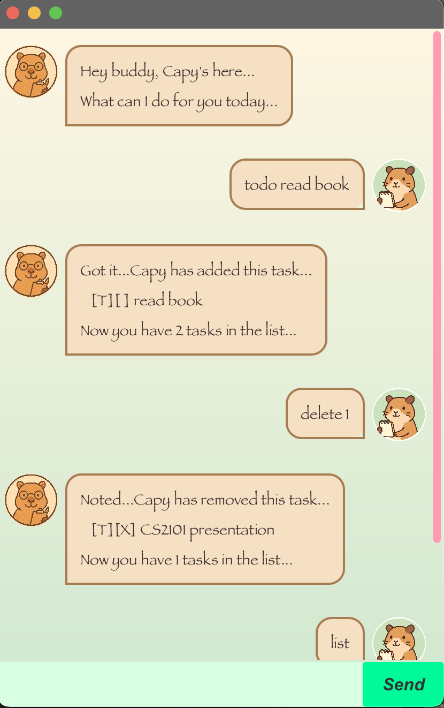

# Capy User Guide



Welcome to Capy! Capy is a ~friendly~ chatbot designed to help you stay ***productive*** in a ***calm, stress-free*** way by keeping track of your <ins>todos, deadlines and events...</ins>

---

## Table of Contents

### Features
- [Adding todos](#adding-todos)
- [Adding deadlines](#adding-deadlines)
- [Adding events](#adding-events)
- [Listing tasks](#listing-tasks)
- [Marking tasks](#marking-tasks)
- [Unmarking tasks](#unmarking-tasks)
- [Deleting tasks](#deleting-tasks)
- [Finding tasks](#finding-tasks)
- [Exiting Capy](#exiting-capy)

### Command Summary Table
- [Command Summary](#command-summary)

---

## Features

### Adding todos

To add a todo task, use the following format: 'todo <task description>'

Example: 
```
todo Read book
```

Expected output: 
```
Got it...Capy has added this task...
  [T][] Read book
Now you have 1 tasks in the list...
```

### Adding deadlines

To add a deadline task, use the following format: 'deadline <task description> /by <yyyy-mm-dd HHmm>'

Example: 
```
deadline Submit assignment /by 2025-09-01 2359
```

Expected output: 
```
Got it...Capy has added this task...
  [D][] Submit assignment (by: Sep 1 2025, 11:59 pm)
Now you have 1 tasks in the list...
```

### Adding events

To add a event task, use the following format: 'event <task description> /from <yyyy-mm-dd HHmm> /to <yyyy-mm-dd HHmm>'

Example: 
```
event Team meeting /from 2025-09-18 1000 /to 2025-09-18 1200
```

Expected output: 
```
Got it...Capy has added this task...
  [E][] Team meeting (from: Sep 18 2025, 10:00 am to: Sep 18 2025, 12:00 pm)
Now you have 1 tasks in the list...
```

### Listing tasks

To list all the tasks, use the following format: 'list'

Example:
```
list
```

Expected output: 
```
Here are the tasks in your list...
1. [T][] Read book
2. [D][] Submit assignment (by: Sep 1 2025, 11:59 pm)
3. [E][] Team meeting (from: Sep 18 2025, 10:00 am to: Sep 18 2025, 12:00 pm)
```


### Marking tasks

To mark a task as done, use the following format: 'mark <task number>'

Example:
```
mark 1
```

Expected output: 
```
Nice...Capy has marked this task as done...
  [T][X] Read book
```

### Unmarking tasks

To mark a task as done, use the following format: 'unmark <task number>'

Example:
```
unmark 1
```

Expected output: 
```
OK...Capy has marked this task as not done yet...
  [T][] Read book
```

### Deleting tasks

To delete a task, use the following format: 'delete <task number>'

Example:
```
delete 2
```

Expected output: 
```
Noted...Capy has removed this task...
  [D][] Submit assignment (by: Sep 1 2025, 11:59 pm)
Now you have 2 tasks in the list...
```

### Finding tasks

To delete a task, use the following format: 'find <keyword>'

Example:
```
find book
```

Expected output: 
```
Here are the matching tasks in your list:
1. [T][] Read book
```

### Exiting Capy

To exit Capy, use the following format: 'bye'

Example:
```
bye
```

Expected output: 
```
Bai...Hope to never see you again...
```

---

### Command Summary

| Command | Format | Example |
|---------|--------|---------|
| [Add Todo](#adding-a-todo) | `todo <task description>` | `todo Read book` |
| [Add Deadline](#adding-a-deadline) | `deadline <task description> /by <yyyy-mm-dd HHmm>` | `deadline Submit assignment /by 2025-09-01 2359` |
| [Add Event](#adding-an-event) | `event <task description> /from <yyyy-mm-dd HHmm> /to <yyyy-mm-dd HHmm>` | `event Project meeting /from 2025-09-01 1400 /to 2025-09-01 1600` |
| [List](#listing-all-tasks) | `list` | `list` |
| [Mark](#marking-a-task) | `mark <task number>` | `mark 1` |
| [Unmark](#unmarking-a-task) | `unmark <task number>` | `unmark 1` |
| [Delete](#deleting-a-task) | `delete <task number>` | `delete 2` |
| [Find](#finding-tasks) | `find <keyword>` | `find book` |
| [Exit](#exiting-capy) | `bye` | `bye` |
